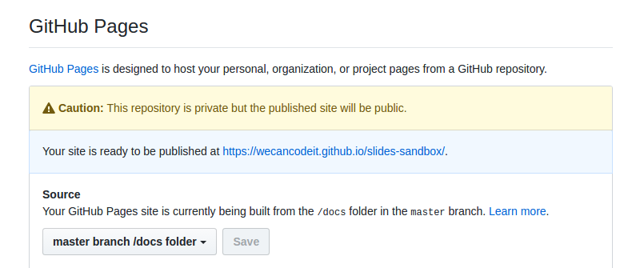

# Publishing slides

The publishing strategy/scripts expects sources that follow the pattern `/<category>/<deck>/index.md`. Any resources (images, etc) used by the slide deck should be placed in `/<category>/<deck>/resources/` and referenced via a relative url. These will be copied during publishing.

To publish a slideshow, navigate to the `/src` directory, then issue the following command:

```bash
./publish.sh <category>/</deck>
```

## Publishing Example

If I want to create a `bar` deck in the `foo` directory, I would create `src/foo/bar/index.md`, then (from the `/src` directory), do:

```bash
./publish.sh foo/bar
```

This example has been published to the repository: https://wecancodeit.github.com/slides-sandbox/foo/bar. Feel free to play with it (but you probably don't want to commit it).

## GitHub Pages

After publishing (and pushing to GitHub), the GitHub Page mechanism (assuming you're turned on GitHub Pages support in your repository's settings), your slideshow can be accessed at the url `https://wecancodeit.github.io/<repository name>/<category>/<deck>`.



Assuming we published to this repository, after adding/committing/pushing, my deck would be avilable at `https://wecancodeit.github/slides-sandbox/foo/bar`.

## Problems with published slides

~~There is a known issue with publishing using new versions of the Liquid gem, a dependency of Slideshow. If you have problems with slideshow generation, you may need to [downgrade to an older version of Liquid](./downgrading-liquid.md).~~ **The problem with liquid has been resolved. Pull the latest to get the updated publishing script and Gemfile.**

# Basic format

For more information, see the README for https://github.com/WeCanCodeIT/wcci-slideshow-template. Also, see the [java-slides repository](https://github.com/WeCanCodeIT/java-slides) for more involved examples.

## Front matter

The first few lines of the `index.md` file for each deck consists of title, subtitle, and theme. All of the decks generated so far have used the *league* them, not sure how other themes may or may not pan out.

Here is an example from a deck where the title is "Branching" and the subtitle is "Control the flow!" ([Live deck here.](https://wecancodeit.github.io/java-slides/fundamentals/branching-statements))
```
title: Branching
subtitle: Control the flow!
theme: league
```

## New Slides

This is kinda misusing headers, but an `<h1>` (`# heading` in Markdown) or `<h2>` (`## heading` in Markdown) causes creation of a new slide.
